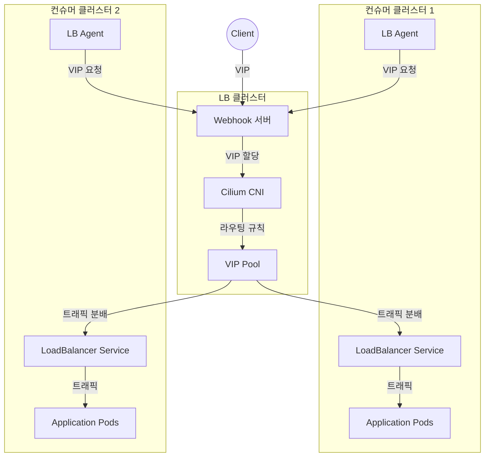

# Kube-LB

Kube-LB는 Kubernetes 기반의 L4 로드밸런서 구현체입니다. 이 프로젝트는 Cilium을 활용하여 VIP(Virtual IP)를 생성하고, 이를 통해 여러 컨슈머 클러스터로의 트래픽을 효율적으로 라우팅하는 솔루션을 제공합니다.

## 아키텍처 다이어그램



## 주요 특징

- **CNI 독립성**: 컨슈머 클러스터는 CNI 종속성 없이 동작
- **VIP 관리**: Cilium을 통한 효율적인 VIP 할당 및 관리
- **멀티 클러스터 지원**: 여러 컨슈머 클러스터에 대한 로드밸런싱 지원
- **자동화된 설정**: Webhook 기반의 자동화된 VIP 할당 및 라우팅 설정

## 아키텍처

프로젝트는 크게 두 가지 주요 컴포넌트로 구성됩니다:

1. **Webhook 서버 (LB 클러스터)**
   - VIP 할당 및 관리
   - Cilium 기반 라우팅 설정
   - 서비스 및 엔드포인트 관리

2. **Agent (컨슈머 클러스터)**
   - 서비스 모니터링
   - Webhook 서버와의 통신
   - 로컬 서비스 설정 관리

## 디렉터리 구조

```
.
├── cmd/
│   ├── webhook/    # LB 클러스터의 Webhook 서버
│   └── agent/      # 컨슈머 클러스터의 에이전트
├── pkg/
│   ├── api/        # Webhook 요청/응답 구조체
│   ├── webhook/    # Webhook 서버 로직
│   ├── agent/      # 에이전트 로직
│   └── cilium/     # Cilium 유틸리티
└── deploy/         # Kubernetes 매니페스트
    ├── kube-lb-cluster/
    └── lb-consumer-cluster/
```

## 설치 및 설정

### LB 클러스터 설정

1. `kube-lb-services` 네임스페이스 생성
2. Webhook 서버 배포
3. RBAC 설정 적용

```bash
kubectl apply -f deploy/kube-lb-cluster/
```

### 컨슈머 클러스터 설정

1. Agent 배포
2. 클러스터 ID 설정
3. Webhook URL 설정

```bash
kubectl apply -f deploy/lb-consumer-cluster/
```

## 사용 방법

1. 컨슈머 클러스터에서 LoadBalancer 타입의 서비스 생성
2. Agent가 자동으로 Webhook 서버에 VIP 할당 요청
3. Webhook 서버가 Cilium을 통해 VIP 할당 및 라우팅 설정
4. 할당된 VIP를 통해 서비스 접근 가능

## 요구사항

- Kubernetes 1.24 이상
- Cilium CNI (LB 클러스터)
- Go 1.24.3

## 라이선스

MIT License